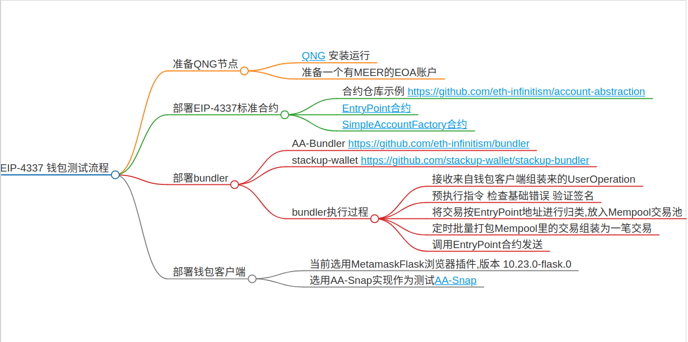

# EIP-4337 Deploy Test

## Structure




- 加密抽象
- 
- Gas抽象

## Qng Node

` Reference https://github.com/Qitmeer/qng`
- Qng testnet deployed addresses
- Available node
- RPC: **http://216.230.226.189:1234**
- ChainID: 8131
```node 
const entryPointAddress = '0x0000000071727De22E5E9d8BAf0edAc6f37da032';
const factoryAddress = '0x12a4F339F74c08F23D8033dF4457eC253DC9AdC0';
```
- EntryPoint Contract Reference https://github.com/eth-infinitism/account-abstraction/blob/develop/contracts/core/EntryPoint.sol
- AccountFactory Contract Reference https://github.com/eth-infinitism/account-abstraction/blob/develop/contracts/samples/SimpleAccountFactory.sol

## Deploy Contract

- install foundry book tool https://book.getfoundry.sh/getting-started/installation
```bash
$ git clone https://github.com/eth-infinitism/account-abstraction
$ # use node 18
$ cd account-abstraction
$ yarn
$ # add network
$ vim hardhat.config.ts
```
```json
  networks: {
    dev: { url: 'http://localhost:8545' },
    // github action starts localgeth service, for gas calculations
    localgeth: { url: 'http://localgeth:8545' },
    goerli: getNetwork('goerli'),
    qngpriv: getNetwork1('http://localhost:1234'), # new add 
    qngtest: getNetwork1('http://216.230.226.189:1234'), # new add
    sepolia: getNetwork('sepolia'),
    proxy: getNetwork1('http://localhost:8545')
  }
```
```bash
$ export ETH_RPC_URL=http://127.0.0.1:1234
$ export RAW_PRIVATE_KEY=xxxxxxxxxxxxxxx
$ # send 10 MEER to 0xf39Fd6e51aad88F6F4ce6aB8827279cffFb92266
$ cast send 0xf39Fd6e51aad88F6F4ce6aB8827279cffFb92266 --value `cast to-wei 10 eth` --private-key $RAW_PRIVATE_KEY --legacy
$ # check balance
$ cast balance 0xf39Fd6e51aad88F6F4ce6aB8827279cffFb92266
$ # modify deploy scripts
$ vim ./scripts/hh-wrapper
```
- hardhat **--network qngpriv** "$@" 2>&1 | `dirname $0`/solcErrors

```bash
$ yarn run deploy

==entrypoint addr= 0x0576a174D229E3cFA37253523E645A78A0C91B57
==SimpleAccountFactory addr= 0x09c58cf6be8E25560d479bd52B4417d15bCA2845

```
### EntryPoint 

- 批量处理UserOp,由bundler 调用 

```solidity
function handleOps(UserOperation[] calldata ops, address payable beneficiary) public;
    /**
     * User Operation struct
     * @param sender the sender account of this request.
     * @param nonce unique value the sender uses to verify it is not a replay.
     * @param initCode if set, the account contract will be created by this constructor/
     * @param callData the method call to execute on this account.
     * @param callGasLimit the gas limit passed to the callData method call.
     * @param verificationGasLimit gas used for validateUserOp and validatePaymasterUserOp.
     * @param preVerificationGas gas not calculated by the handleOps method, but added to the gas paid. Covers batch overhead.
     * @param maxFeePerGas same as EIP-1559 gas parameter.
     * @param maxPriorityFeePerGas same as EIP-1559 gas parameter.
     * @param paymasterAndData if set, this field holds the paymaster address and paymaster-specific data. the paymaster will pay for the transaction instead of the sender.
     * @param signature sender-verified signature over the entire request, the EntryPoint address and the chain ID.
     */
    struct UserOperation {

        address sender;
        uint256 nonce;
        bytes initCode;
        bytes callData;
        uint256 callGasLimit;
        uint256 verificationGasLimit;
        uint256 preVerificationGas;
        uint256 maxFeePerGas;
        uint256 maxPriorityFeePerGas;
        bytes paymasterAndData;
        bytes signature;
    }

```

- getUserOpHash 获取当前用户UserOp的唯一Hash值 类似EOA里的交易Hash

```solidity
function getUserOpHash(UserOperation calldata userOp) public view returns (bytes32) ;
```

- getSenderAddress 获取或者创建发送者的AA钱包地址

```solidity
function getSenderAddress(bytes calldata initCode) public;
/**
  * initCode = factoryAddress + initCallData
**/
```

### AccountFactory

- validateUserOp 验证UserOp是否正确
  
```solidity
function validateUserOp(UserOperation calldata userOp, bytes32 userOpHash, uint256 missingAccountFunds) external override virtual returns (uint256 validationData);
```

- createAccount 创建AA钱包账户

```solidity
function createAccount(address owner,uint256 salt) public returns (SimpleAccount ret);
```

- 1 创建账户2种方式 一是主动调用AccountFactory.createAccount 创建
- 2 将createAccount 预执行获取SimpleAccount 合约字节码作为 initCallData 由用户发起一笔AA 交易 携带 initCode 参数创建 `initCode = factoryAddress + initCallData`
  

## run bundler

### AA Bundler 

``` bash
$ git clone https://github.com/eth-infinitism/bundler
$ cd bundler
$ yarn
$ yarn run bundler
$ # config file 
$ vim packages/bundler/localconfig/bundler.config.json
$ # simple test 
$ yarn run runop --deployFactory --network http://127.0.0.1:1234/ --entryPoint 0x0576a174D229E3cFA37253523E645A78A0C91B57 
$ bundler rpc http://127.0.0.1:3000/rpc
```
- AA Bundler Support JsonRPC Methods

```node
    case 'eth_chainId':
        // eslint-disable-next-line no-case-declarations
        const { chainId } = await this.provider.getNetwork()
        result = chainId
        break
    case 'eth_supportedEntryPoints':
        result = await this.methodHandler.getSupportedEntryPoints()
        break
    case 'eth_sendUserOperation':
        result = await this.methodHandler.sendUserOperation(params[0], params[1])
        break
    case 'eth_estimateUserOperationGas':
        result = await this.methodHandler.estimateUserOperationGas(params[0], params[1], params[2])
        break
    case 'eth_getUserOperationReceipt':
        result = await this.methodHandler.getUserOperationReceipt(params[0])
        break
    case 'eth_getUserOperationByHash':
        result = await this.methodHandler.getUserOperationByHash(params[0])
        break
    case 'web3_clientVersion':
        result = this.methodHandler.clientVersion()
        break
    case 'debug_bundler_clearState':
        this.debugHandler.clearState()
        result = 'ok'
        break
    case 'debug_bundler_dumpMempool':
        result = await this.debugHandler.dumpMempool()
        break
    case 'debug_bundler_clearMempool':
        this.debugHandler.clearMempool()
        result = 'ok'
        break
    case 'debug_bundler_setReputation':
        await this.debugHandler.setReputation(params[0])
        result = 'ok'
        break
    case 'debug_bundler_dumpReputation':
        result = await this.debugHandler.dumpReputation()
        break
    case 'debug_bundler_clearReputation':
        this.debugHandler.clearReputation()
        result = 'ok'
        break
    case 'debug_bundler_setBundlingMode':
        await this.debugHandler.setBundlingMode(params[0])
        result = 'ok'
        break
    case 'debug_bundler_setBundleInterval':
        await this.debugHandler.setBundleInterval(params[0], params[1])
        result = 'ok'
        break
    case 'debug_bundler_sendBundleNow':
        result = await this.debugHandler.sendBundleNow()
        if (result == null) {
          result = 'ok'
        }
        break
    case 'debug_bundler_getStakeStatus':
        result = await this.debugHandler.getStakeStatus(params[0], params[1])
        break
```

- eth_sendUserOperation 接收钱包客户端发送过来的UserOp 放入Mempool

```node
sendUserOperation (userOp: UserOperation, entryPointInput: string){}
export interface UserOperation {
    sender: string;
    nonce: BigNumberish;
    factory?: string;
    factoryData?: BytesLike;
    callData: BytesLike;
    callGasLimit: BigNumberish;
    verificationGasLimit: BigNumberish;
    preVerificationGas: BigNumberish;
    maxFeePerGas: BigNumberish;
    maxPriorityFeePerGas: BigNumberish;
    paymaster?: string;
    paymasterVerificationGasLimit?: BigNumberish;
    paymasterPostOpGasLimit?: BigNumberish;
    paymasterData?: BytesLike;
    signature: BytesLike;
}
```
- bundler 从Mempool 拿取交易 createBundler -> sendBundler 上链
  
```node
async createBundle (){}

async sendBundle (userOps: UserOperation[], beneficiary: string, storageMap: StorageMap){}
```

### stackup-bundler

```bash
$ git clone https://github.com/stackup-wallet/stackup-bundler.git
$ cd stackup-bundler
$ # config
$ vim .env
$ export ERC4337_BUNDLER_ETH_CLIENT_URL=http://127.0.0.1:1234
$ export ERC4337_BUNDLER_PRIVATE_KEY=ce729ed7105fcb43747a0d1ccd6f6a719dd9b591c1da9a35bffbdbde51f55713
$ export ERC4337_BUNDLER_PORT=3000
$ export ERC4337_BUNDLER_DEBUG_MODE=true
$ export ERC4337_BUNDLER_SUPPORTED_ENTRY_POINTS=0x0576a174D229E3cFA37253523E645A78A0C91B57
$ go mod tidy
$ go build
$ ./stackup-bundler start --mode private
$ bundler rpc http://127.0.0.1:3000/rpc or http://127.0.0.1:3000
```
- JsonRPC support methods

```golang

// Eth_sendUserOperation routes method calls to *Client.SendUserOperation.
func (r *RpcAdapter) Eth_sendUserOperation(op userOperation, ep string) (string, error) {
	return r.client.SendUserOperation(op, ep)
}

// Eth_estimateUserOperationGas routes method calls to *Client.EstimateUserOperationGas.
func (r *RpcAdapter) Eth_estimateUserOperationGas(
	op userOperation,
	ep string,
	os optional_stateOverride,
) (*gas.GasEstimates, error) {
	return r.client.EstimateUserOperationGas(op, ep, os)
}

// Eth_getUserOperationReceipt routes method calls to *Client.GetUserOperationReceipt.
func (r *RpcAdapter) Eth_getUserOperationReceipt(
	userOpHash string,
) (*filter.UserOperationReceipt, error) {
	return r.client.GetUserOperationReceipt(userOpHash)
}

// Eth_getUserOperationByHash routes method calls to *Client.GetUserOperationByHash.
func (r *RpcAdapter) Eth_getUserOperationByHash(
	userOpHash string,
) (*filter.HashLookupResult, error) {
	return r.client.GetUserOperationByHash(userOpHash)
}

// Eth_supportedEntryPoints routes method calls to *Client.SupportedEntryPoints.
func (r *RpcAdapter) Eth_supportedEntryPoints() ([]string, error) {
	return r.client.SupportedEntryPoints()
}

// Eth_chainId routes method calls to *Client.ChainID.
func (r *RpcAdapter) Eth_chainId() (string, error) {
	return r.client.ChainID()
}

// Debug_bundler_clearState routes method calls to *Debug.ClearState.
func (r *RpcAdapter) Debug_bundler_clearState() (string, error) {
	if r.debug == nil {
		return "", errors.New("rpc: debug mode is not enabled")
	}

	return r.debug.ClearState()
}

// Debug_bundler_dumpMempool routes method calls to *Debug.DumpMempool.
func (r *RpcAdapter) Debug_bundler_dumpMempool(ep string) ([]map[string]any, error) {
	if r.debug == nil {
		return []map[string]any{}, errors.New("rpc: debug mode is not enabled")
	}

	return r.debug.DumpMempool(ep)
}

// Debug_bundler_sendBundleNow routes method calls to *Debug.SendBundleNow.
func (r *RpcAdapter) Debug_bundler_sendBundleNow() (string, error) {
	if r.debug == nil {
		return "", errors.New("rpc: debug mode is not enabled")
	}

	return r.debug.SendBundleNow()
}

// Debug_bundler_setBundlingMode routes method calls to *Debug.SetBundlingMode.
func (r *RpcAdapter) Debug_bundler_setBundlingMode(mode string) (string, error) {
	if r.debug == nil {
		return "", errors.New("rpc: debug mode is not enabled")
	}

	return r.debug.SetBundlingMode(mode)
}

// Debug_bundler_setReputation routes method calls to *Debug.SetReputation.
func (r *RpcAdapter) Debug_bundler_setReputation(entries []any, ep string) (string, error) {
	if r.debug == nil {
		return "", errors.New("rpc: debug mode is not enabled")
	}

	return r.debug.SetReputation(entries, ep)
}

// Debug_bundler_dumpReputation routes method calls to *Debug.DumpReputation.
func (r *RpcAdapter) Debug_bundler_dumpReputation(ep string) ([]map[string]any, error) {
	if r.debug == nil {
		return []map[string]any{}, errors.New("rpc: debug mode is not enabled")
	}

	return r.debug.DumpReputation(ep)
}

```
- Eth_sendUserOperation 接收钱包客户端来的UserOp 并放入内存池
```golang
func (i *Client) SendUserOperation(op map[string]any, ep string) (string, error);
type UserOperation struct {
	Sender               common.Address `json:"sender"               mapstructure:"sender"               validate:"required"`
	Nonce                *big.Int       `json:"nonce"                mapstructure:"nonce"                validate:"required"`
	InitCode             []byte         `json:"initCode"             mapstructure:"initCode"             validate:"required"`
	CallData             []byte         `json:"callData"             mapstructure:"callData"             validate:"required"`
	CallGasLimit         *big.Int       `json:"callGasLimit"         mapstructure:"callGasLimit"         validate:"required"`
	VerificationGasLimit *big.Int       `json:"verificationGasLimit" mapstructure:"verificationGasLimit" validate:"required"`
	PreVerificationGas   *big.Int       `json:"preVerificationGas"   mapstructure:"preVerificationGas"   validate:"required"`
	MaxFeePerGas         *big.Int       `json:"maxFeePerGas"         mapstructure:"maxFeePerGas"         validate:"required"`
	MaxPriorityFeePerGas *big.Int       `json:"maxPriorityFeePerGas" mapstructure:"maxPriorityFeePerGas" validate:"required"`
	PaymasterAndData     []byte         `json:"paymasterAndData"     mapstructure:"paymasterAndData"     validate:"required"`
	Signature            []byte         `json:"signature"            mapstructure:"signature"            validate:"required"`
}
```
- Process 定时拿取交易池中UserOp 进行组装Bundler 调用EntryPoint合约上链
  
```golang
func (i *Bundler) Process(ep common.Address) (*modules.BatchHandlerCtx, error)
relayer.SendUserOperation() 
func HandleOps(opts *Opts) (txn *types.Transaction, err error)
```

### AASnap

- install metamask flask 10.23.0 (before install , must uninstall metamask)

```bash
$ git clone https://github.com/a42io/AAsnap
$ cd AAsnap
$ nvm use 18
$ yarn
$ yarn run start
```
- 由于版本过久 依赖的账户合约 是旧的 所以没法直接用，本地做了修改 但不是更新依赖包做法
- site 模块 为钱包网站前端应用代码
  
```node 
export const transferFromAA = async (target: string, ethValue: string) => {
  await window.ethereum.request({
    method: 'wallet_invokeSnap',
    params: [
      defaultSnapOrigin,
      {
        method: 'transfer',
        params: {
          target,
          ethValue,
        },
      },
    ],
  });
};
```
- snap 模块 为metamask扩展代码将被安装到Metamask Snap扩展中 有site 调用 metamask 标准API方法 - 再调用snap 方法，snap方法主要与bundler交互，以及创建用户账户，需要accountFACTORY 合约 以及entryPoint合约
- 创建 AA钱包账户

```node 
export const getAbstractAccount = async (): Promise<SimpleAccountAPI> => {
  const provider = new ethers.providers.Web3Provider(wallet as any);
  await provider.send('eth_requestAccounts', []);
  const owner = provider.getSigner();
  const aa = new SimpleAccountAPI({
    provider,
    entryPointAddress,
    owner,
    factoryAddress,
  });
  return aa;
};

  const aa = await getAbstractAccount();
  const address = await aa.getAccountAddress();

    /**
     * return the account's address.
     * this value is valid even before deploying the contract.
     */
    async getAccountAddress() {
        if (this.senderAddress == null) {
            if (this.accountAddress != null) {
                this.senderAddress = this.accountAddress;
            }
            else {
                this.senderAddress = await this.getCounterFactualAddress();
            }
        }
        return this.senderAddress;
    }
    async getCounterFactualAddress() {
        const initCode = this.getAccountInitCode();
        // use entryPoint to query account address (factory can provide a helper method to do the same, but
        // this method attempts to be generic
        try {
            await this.entryPointView.callStatic.getSenderAddress(initCode);
        }
        catch (e) {
            return e.errorArgs.sender;
        }
        throw new Error('must handle revert');
    }
        /**
     * return the value to put into the "initCode" field, if the account is not yet deployed.
     * this value holds the "factory" address, followed by this account's information
     */
    async getAccountInitCode() {
        if (this.factory == null) {
            if (this.factoryAddress != null && this.factoryAddress !== '') {
                this.factory = contracts_1.SimpleAccountFactory__factory.connect(this.factoryAddress, this.provider);
            }
            else {
                throw new Error('no factory to get initCode');
            }
        }
        return (0, utils_1.hexConcat)([
            this.factory.address,
            this.factory.interface.encodeFunctionData('createAccount', [await this.owner.getAddress(), this.index])
        ]);
    }
```
  
```node
const op = await aa.createSignedUserOp({
    target,
    value,
    data: '0x',
    maxFeePerGas: 0x6507a5e0,
    maxPriorityFeePerGas: 0x6507a5d0,
  });
  op.preVerificationGas = 51108;
  const printedOp = await printOp(op);
  const userOp = JSON.parse(printedOp);
  // check
  // if (userOp.initCode) {
  //   userOp.factory = aa.factoryAddress;
  //   userOp.factoryData = userOp.initCode;
  // }

  console.log(`Signed UserOperation: ${printedOp}`);
  const body = JSON.stringify({
    method: 'Eth_sendUserOperation',
    id: 1,
    jsonrpc: '2.0',
    params: [userOp, aa.entryPointAddress],
  });
  // bundler 不统一
  const response = await fetch('http://127.0.0.1:3000/rpc', {
    method: 'POST',
    headers: {
      'Content-Type': 'application/json',
    },
    body,
  });
  const { uoHash } = await response.json();
  console.log(uoHash);
};

```

### https://github.com/dawnwallet/erc4337-wallet

- 支持secp256 r1,苹果指纹加密 支持该算法
- accountWallet合约 记录公钥

```solidity
    /// @dev Validate combination of message, signature, and public key.
    /// @param message Hash of the signed message
    /// @param rs signature
    /// @param Q public key, that the signature should recover to
    function validateSignature(bytes32 message, uint256[2] memory rs, uint256[2] memory Q) public pure returns (bool)

```

### https://github.com/SoulWallet/soul-wallet-contract

- 支持eip1271 isValidSignture
- 支持主要用到 eth 地址recover 算法 来去验证
- 功能模块化 EIP - 6900 
```solidity
  (address recoveredAddr, ECDSA.RecoverError error,) = ECDSA.tryRecover(rawHash, rawSignature);
```

### MPC 多私钥 还是ETH做法 只是私钥不可见 对于验证也是用recover